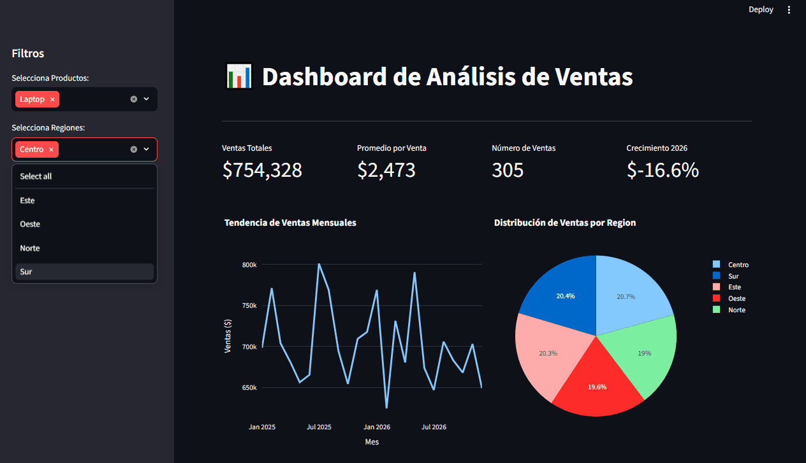
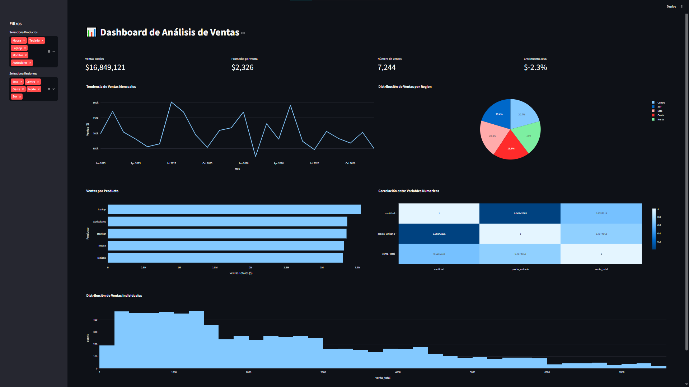

# 📊 Dashboard de Análisis de Ventas


Dashboard interactivo desarrollado con **Streamlit** y **Plotly** para visualizar indicadores de ventas mediante gráficos dinámicos, filtros interactivos y métricas (KPIs).

Este proyecto fue desarrollado con fines de aprendizaje para practicar el desarrollo de aplicaciones web para Ciencia de Datos utilizando Python.

---

# 🚀 Demo

### 🎥 Vista previa

> *(Reemplazar por un GIF grabado con ScreenToGif)*

<p align="center">

</p>

---

# 📸 Captura del Dashboard

<p align="center">

</p>

---

# ✨ Funcionalidades

- 📌 Dashboard interactivo desarrollado con Streamlit
- 📈 KPIs de ventas
- 📅 Tendencia mensual de ventas
- 🥧 Distribución de ventas por región
- 📊 Ventas por producto
- 🔥 Matriz de correlación
- 📉 Histograma de distribución de ventas
- 🎛️ Filtros dinámicos por:
  - Producto
  - Región
- 📱 Diseño responsive utilizando columnas de Streamlit

---

# 🛠 Tecnologías utilizadas

- Python 3.12
- Streamlit
- Plotly
- Pandas
- NumPy
- Matplotlib
- Seaborn

---


# 📂 Estructura del proyecto

```text
streamlit-dashboard-learning/
│
├── app.py
├── data/
│   └── ventas.csv
│
├── images/
│   ├── dashboard.png
│   └── dashboard-demo.gif
│
├── requirements.txt
├── README.md
└── .streamlit/
```

---

# ⚙️ Instalación

## 1. Clonar el repositorio

```bash
git clone https://github.com/matiaga/streamlit-dashboard-learning.git
```

## 2. Entrar al proyecto

```bash
cd streamlit-dashboard-learning
```

## 3. Crear un entorno (opcional)

Con Conda

```bash
conda create -n dashboard python=3.12
conda activate dashboard
```

## 4. Instalar dependencias

```bash
pip install -r requirements.txt
```

## 5. Ejecutar la aplicación

```bash
streamlit run app.py
```

---

# 📊 Objetivos de aprendizaje

Durante este proyecto practiqué:

- Construcción de dashboards con Streamlit.
- Visualización de datos con Plotly.
- Creación de KPIs.
- Uso de filtros interactivos.
- Organización de aplicaciones de Ciencia de Datos.
- Personalización del diseño de una aplicación web.

---

# 📚 Fuente de aprendizaje

Este proyecto fue desarrollado con fines educativos tomando como referencia el tutorial del canal **Código Espinoza**.

Durante el desarrollo se realizaron adaptaciones y personalizaciones para reforzar el aprendizaje de Streamlit y Plotly.

Canal:

https://www.youtube.com/@CodigoEspinoza

---

# 🚀 Próximas mejoras

- Agregar conexión a base de datos.
- Incorporar filtros por fecha.
- Mejorar la experiencia de usuario.
- Incorporar mapas interactivos.
- Publicar la aplicación en Streamlit Community Cloud.

---

# 👩‍💻 Autor

**Mónica Atiaga**

Ingeniera en Computación | Ciencia de Datos | Machine Learning

GitHub:

https://github.com/matiaga

LinkedIn:

https://www.linkedin.com/in/monica-atiaga
